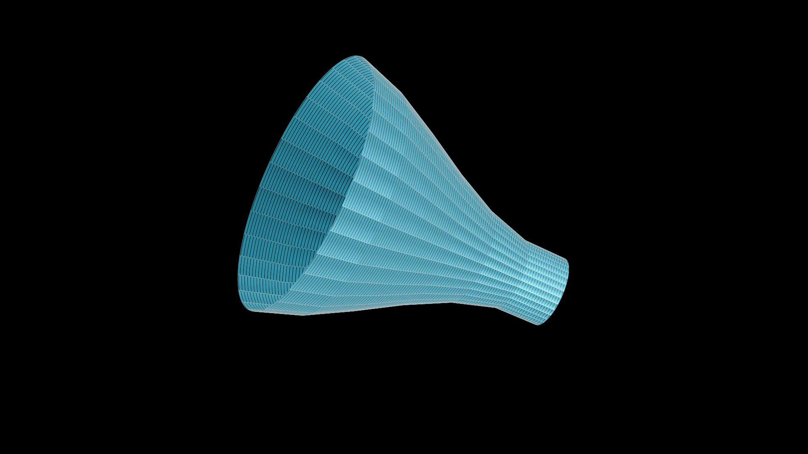

# manim_solid_of_revolution

If you are using a simple function line a linear or quadratic, just simply solve for the other variable, no need to use this.

This script will create many smaller cones from f(x) to imitate a solid of revolution because making one with one parametric function is hard (for me).

How to use:
Initiate the object. Then a method will be called instantly just to create enough variables and numbers and constants for other methods.

Call methods will return VGroup() type (usable for manim) and you can play animation as soon as possible.

Code is flexible so you can change it easily since there are many variables recorded. You can manipulate it however you want. Peace out.
